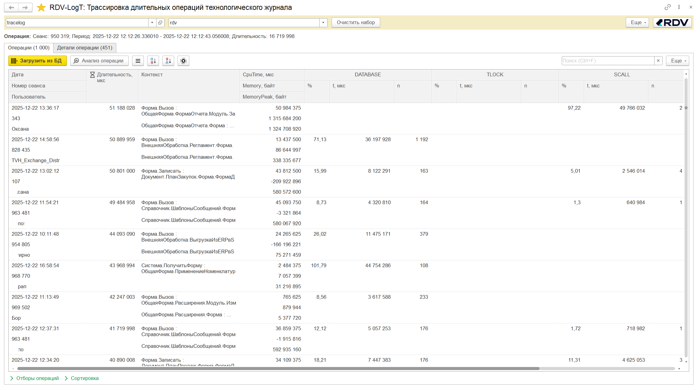

# 📘 Руководство пользователя RDV-LogT

## 📑 Содержание
- [📘 Руководство пользователя RDV-LogT](#-руководство-пользователя-rdv-logt)
  - [📑 Содержание](#-содержание)
  - [1. Назначение инструмента](#1-назначение-инструмента)
  - [2. Требования к окружению](#2-требования-к-окружению)
  - [3. Подготовка базы ClickHouse](#3-подготовка-базы-clickhouse)
  - [4. Подключение расширения 1С](#4-подключение-расширения-1с)
  - [5. Настройка подключения к БД](#5-настройка-подключения-к-бд)
  - [6. Загрузка данных технологического журнала](#6-загрузка-данных-технологического-журнала)
  - [7. Просмотр операций](#7-просмотр-операций)
  - [8. Анализ выбранной операции](#8-анализ-выбранной-операции)


## 1. Назначение инструмента

RDV-LogT предназначен для **оперативного поиска причин длительных операций** в системах на платформе 1С. 
Инструмент:
- восстанавливает **хронологию одной пользовательской операции** по `clientID` (от `VRSREQUEST` до `VRSRESPONSE`);
- восстанавливает **хронологию одного фонового задания** по `SessionID` (от `SESN, Func=Start` до `SESN, Func=Finish`);
- агрегирует и **подсчитывает вклад** каждого типа событий (DB, блокировки, вызовы, исключения и т.д.) в общую длительность;
- предоставляет **контексты выполнения** (последняя строка и дерево контекстов) для точной локализации проблемного участка кода;
- дает **визуализацию** (таймлайн событий) для наглядного анализа «узких мест»;
- сохраняет данные в ClickHouse, что позволяет быстро строить **гибкие запросы и отчеты** поверх накопленной истории.

---

## 2. Требования к окружению

Для работы инструмента необходимо обеспечить наличие следующего ПО:

- **Python 3.13+**
- **ОС**: Windows / Linux
- **ClickHouse 25.6+**
- Зависимости Python:
  ```bash
  pip install requests tqdm
  ```

Перед началом работы необходимо создать базу данных `tracelog` (или любое другое наименование) и необходимые таблицы. См. [README.md](../README.md) → раздел «Быстрый старт».

---

## 3. Подготовка базы ClickHouse

1. Убедитесь, что база данных `tracelog` создана.  
   Пример проверки через Web UI:  
   

2. Для выполнения анализа требуется собрать данные **полного технологического журнала в один файл** или **ограниченного технологического журнала с разделением событий по каталогам**.  
   Скачайте конфигурационный файл [`logcfg-full.xml`](example/logcfg-full.xml) или [`logcfg-filter.xml`](example/logcfg-filter.xml) и поместите его в каталог 1С в соответствии с инструкциями вендора (или дополните существующий файл).

---

## 4. Подключение расширения 1С

1. Подключите расширение из каталога [Каталог releases_1c](../releases_1c) в любую конфигурацию 1С.  
   

2. Запустите базу и перейдите в раздел **«LT: Трассировка технологического журнала»**.  
   Откройте обработку **«RDV-LogT: Трассировка длительных операций»**.  
   

---

## 5. Настройка подключения к БД

1. Создайте новый элемент в справочнике «Базы данных»:  
   - **Наименование** – любое удобное название.  
   - **Тип базы данных** – ClickHouse.  
   - **Сервер СУБД** – имя или IP сервера ClickHouse.  
   - **Порт** – по умолчанию 8123.  
   - **Таймаут соединения** – по умолчанию 30 секунд.  
   - **Имя базы данных** – `tracelog`.  
   - **Логин и пароль** – учетные данные пользователя ClickHouse.  

   

2. Заполните поле **«Набор данных»** — это логическая метка для разделения данных по информационным базам, организациям и т.п. Можно выбрать существующую в БД ClickHouse или ввести новую вручную.
 
   

   Команда **«Очистить набор»** позволяет удалить все данные всех таблиц из ClickHouse по выбранному набору.

---

## 6. Загрузка данных технологического журнала

1. Перейдите на страницу **«Операции»** и нажмите команду **«Обработать данные ТЖ»**.  
   

2. В открывшейся форме укажите путь к каталогу с технологическим журналом и путь к каталогу хранения логов обработки.
3. Выберите необходимый **«Режим обработки»** (добавлено в релизе 1.0.1). 
   - **Все события в одном файле** - используется, если настроен полный технологический журнал в один каталог. Таким образом, все события идут в хронологическом порядке в одном файле каждого часа. Пример настройки ТЖ [`logcfg-full.xml`](example/logcfg-full.xml)
   - **События разделены по каталогам** - используется, если разные типы событий сохраняются в разные каталоги. Таким образом, требуется предварительно собрать все события из разных каталогов и файлов *.log и выстроить их в едином хронологическом порядке. Пример настройки ТЖ [`logcfg-filter.xml`](example/logcfg-filter.xml)
   
   

4. Выберите какие операции обрабатывать (добавелно в релизе 2.0.0)
   - **Обработать клиент-серверные вызовы** - в результат обработки попадут пользовательские операции, которые начинаются на клиенте, выполняются на сервере и возвращаются на клиент (`VRSREQUEST ... VRSRESPONCE`).
   - **Обработать фоновые задания** - в результат обработки попадут фоновые задания, которые начинаются на сервере и завершаются тоже на сервере (`SESN, Func=Start ... SESN, Func=Finish`)

   

5. Нажмите **«Обработать»**. В процессе выполнения будет вестись логирование в консоль и в файл.  

   

6. После завершения появится уведомление **«Обработка завершена»**.  

   

---

## 7. Просмотр операций

1. Закройте форму обработки и вернитесь на страницу **«Операции»**.  
   Нажмите **«Загрузить»** — в табличную часть загрузятся все операции ТЖ.  
   
   

2. Дополнительно существует возможность установить **отборы операций**. Например:
   - для аналиа операций конкретного пользоватя (`user` или `sessiod_id`)
   - для поиска стека вызовов виновника блокировок (`connect_id`)
   - операции за период (`ts_vrsrequest` или `ts_vrsrequest`)

   Также можно установить произвольную сортировку событий на уровне запроса к СУБД.

   

3. Каждая операция содержит:
   - длительность, начало и конец с точностью до микросекунд;
   - номер пользовательского сеанса (**SessionID**) и имя пользователя (**Usr**);
   - **Context** выполнения кода (первая найденная строка).

4. Для каждой операции отображаются данные из события CALL:
   - Значение свойства CpuTime из события CALL. Показывает сколько времени событие обрабатывалось на процессоре сервера 1С.
   - Значение свойства Memory из события CALL. Показывает объем памяти в байтах, занятой, но не освобожденной за серверный вызов.
   - Значение свойства MemoryPeak из события CALL. Показывает пиковое значение за вызов памяти в байтах, занятой, но не освобожденной.
5. Дополнительно отображается **статистика по событиям** внутри операции (например, `DBMSSQL`, `DBPOSTGRS`, `TLOCK`, `SCALL`):  
   - (t, мкс) - суммарная длительность (микросекунды);  
   - (n) - количество;  
   - (%) - доля  от общей длительности операции.  
   
   

6. Визуальные колонки, сигнализирующие о наличии событий `TTIMEOUT`, `TDEADLOCK`, `EXCP` и другие системные события (`CLSTR`, `ADDIN` и т.д.)

   

---

## 8. Анализ выбранной операции

1. Выберите интересующую операцию и нажмите **«Анализ операции»**.  
   
   

2. На вкладке **«Детали операции»** доступны:  
   - **События операции** — полный набор всех событий с длительностью и временными метками.  
   - **График событий** — визуализация последовательности операций.  
   - **Последняя строка контекста** — сводка самых затратных строк кода.  
   - **Дерево контекстов** — вложенный стек вызовов с длительностями.  

   Для любого события можно открыть **полный контекст события** и увидеть представление события в технологическом журнале:  

   

   А также **полный контекст событий операции** и увидеть представление операции и всех событий в технологическом журнале:  

   

3. Доступна сортировка по длительности и «пустотам»:  
   - **Длительность (мкс)** — время выполнения события.  
   - **Пустота (мкс)** — вычисляется как: время между текущим и предыдущим событием минус длительность текущего события (отражает сколько времени выполнялся программный код на процессоре сервера 1С. Такие операции не попадают в технологический журнал, а отображаются в событии `CALL` в свойстве `CpuTime`).  
   
   

4. **Последняя строка контекста** помогает понять, какая конкретная строка кода занимает больше всего времени, независимо от стека вызова. 

   В релизе 2.0.0 на вкладе "Последняя строка контекстов" добавлена информация о полном стеке вызовов этой последней строки. Это помогает понять откуда вызывалась последняя строка контекта и какой стек занял самое длительное время. 
   

5. **Дерево контекстов** облегчает анализ стека вызовов с привязкой к длительности и времени.  
   

6. **График событий** помогает визуально выделять массовые и пиковые события.  
   


---